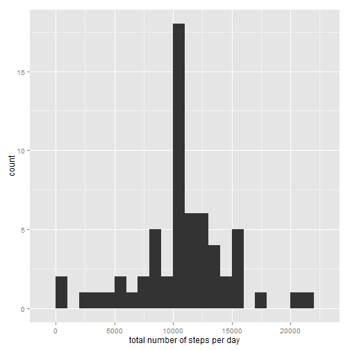
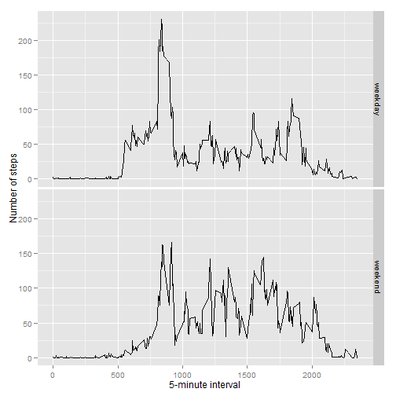

# Reproducible Research: Peer Assessment 1

## Loading and preprocessing the data


```r
unzip(zipfile="activity.zip")
raw.data <- read.csv("activity.csv")
```

## What is mean total number of steps taken per day?
For this part of the assignment, you can ignore the missing values in the dataset.

### Histogram of the total number of steps per day

```r
library(ggplot2)
total.steps <- tapply(raw.data$steps, raw.data$date, FUN=sum, na.rm=T)
qplot(total.steps, binwidth=1000, xlab="total number of steps per day")
```

 

### Mean and Median total number of steps per day

```r
mean(total.steps, na.rm=T)
```

```
## [1] 9354
```

```r
median(total.steps, na.rm=T)
```

```
## [1] 10395
```

## What is the average daily activity pattern?
### Time series plot of the 5-minute interval (x-axis) vs. average number of steps, averaged across all days (y-axis)

```r
library(ggplot2)
average.daily.steps <- aggregate(x=list(steps=raw.data$steps), by=list(interval=raw.data$interval), mean, na.rm=T)
ggplot(data=average.daily.steps, aes(x=interval, y=steps)) +
    geom_line() +
    xlab("5-minute interval") +
    ylab("average number of steps taken")
```

 

### Which 5-minute interval, on average across all the days in the dataset, contains the maximum number of steps?

```r
average.daily.steps[which.max(average.daily.steps$steps),]
```

```
##     interval steps
## 104      835 206.2
```

## Inputing missing values
There are many days/intervals where there are missing values (coded as `NA`). The presence of missing days may introduce bias into some calculations or summaries of the data.

### Total number of missing values in the dataset (i.e. the total number of rows with `NA`s)

```r
missing.data <- is.na(raw.data$steps)
table(missing)
```

```
## Error: unique() applies only to vectors
```

### Filling strategy for missing values
All `NA` values are replaced with the mean value for the relevant 5 minute interval.

```r
# Replace each missing value with the mean value of its 5-minute interval
filling.strategy <- function(steps, interval) {
    if (!is.na(steps))
        steps
    else
        average.daily.steps[average.daily.steps==interval, "steps"][1]
}
filled.data <- raw.data
filled.data$steps <- mapply(filling.strategy, filled.data$steps, filled.data$interval)
```

### Histogram of the total number of steps per day (with filling strategy)

```r
total.steps.filled <- tapply(filled.data$steps, filled.data$date, sum)
qplot(x=total.steps.filled, binwidth=1000, xlab="total number of steps per day")
```

 

### Mean and Median total number of steps per day (with filling strategy)

```r
mean(total.steps.filled)
```

```
## [1] 10766
```

```r
median(total.steps.filled)
```

```
## [1] 10766
```

### Is there a difference by using this filling strategy?
Mean and median values are higher after filling in missing data. This is due to the fact that there are some days where all `steps` values are `NA` across all intervals. 

Normally the total number of steps for these days would be calculated as 0. However, by replacing missing values with the mean `steps` over the associated `interval`, the 0 values are now near-removed from the total number of steps taken per day. 

The resulting graph now has a greater frequency of values around the mean in the unfilled dataset (now that it also includes the previously unfilled `NA` entries). As such not only is the mean higher, but the median is far more likely to be equal to the mean.

## Are there differences in activity patterns between weekdays and weekends?

### Create a new factor variable in the dataset with two levels - "weekday" and "weekend" indicating whether a given date is a weekday or weekend day.


```r
weekday.category <- function(date) {
    day <- weekdays(date)
    if (day %in% c("Monday", "Tuesday", "Wednesday", "Thursday", "Friday"))
        return("weekday")
    else if (day %in% c("Saturday", "Sunday"))
        return("weekend")
    else
        stop("invalid date")
}
filled.data$day <- sapply(as.Date(filled.data$date), weekday.category)
```
### Create a panel plot containing a time series plot of 5-minute interval (x-axis) and the average number of steps taken, averaged across all weekday days or weekend days (y-axis).

```r
filled.averages <- aggregate(steps ~ interval + day, data=filled.data, mean)
ggplot(filled.averages, aes(interval, steps)) + geom_line() + facet_grid(day ~ .) +
    xlab("5-minute interval") + ylab("Number of steps")
```

 
